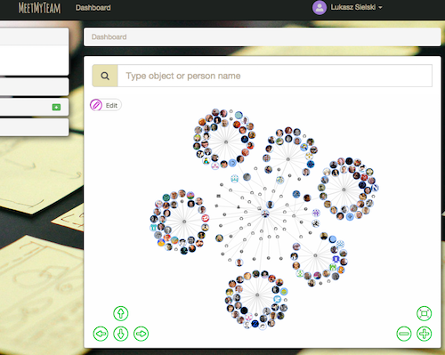
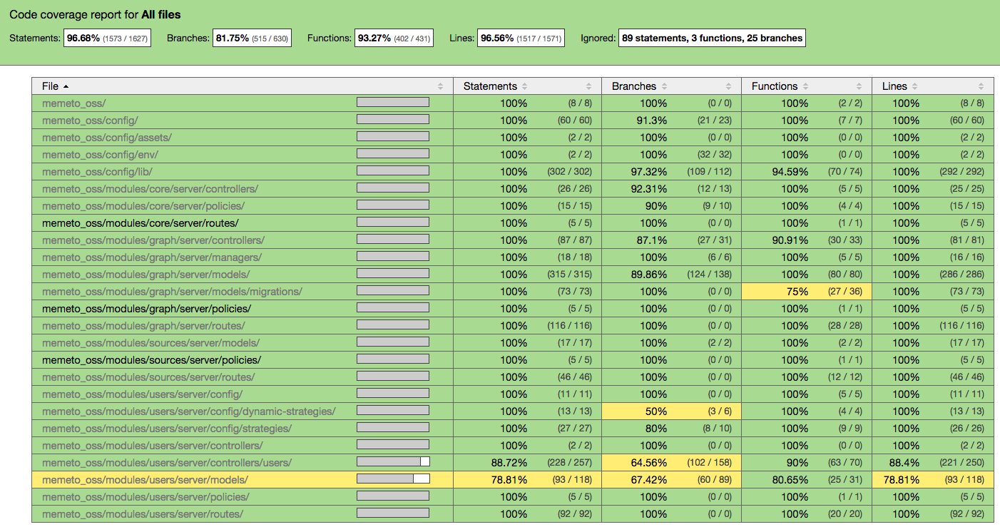

# Memeto

See example at [sielayltd.github.io/memeto](sielayltd.github.io/memeto).

> So many tools, so little time
 
Often you use Slack or email to ask similar questions:

> WHO IS project manager FOR example.com?
>
> WHAT project DEPENDS ON jQuery?
>
> WHERE IS Lukasz Sielski?

Why not make it work as your query language? Why not bind all that data in one place?



## Key facts

 * Based on awesome [MEANJS](http://meanjs.org) project
 * Currently both [MongoDB](http://mongodb.org) and [OrientDB](http://orientdb.com)
 * It's __FREE__ also for commercial use, but all modifications have to be open source as long you don't obtain commercial licence
 * It has __HUGE__ test code coverage. Currently tests cover 96%+ active server side code
 * Parts of it will be published under MIT licence to be (hopefully) merged back to MEANJS. Follow our [cleanmean](https://github.com/sielayltd/cleanmean) project
 * It's still under development (see [status](#Status))

<!-- RM-IGNORE -->
## Table of contents
<!-- /RM-IGNORE -->

<!-- RM(tree:*) -->

* [Key facts](#key-facts)
* [Status](#status)
* [Architecture](#architecture)
* [Prerequirements](#prerequirements)
* [Installation](#installation)
* [Test](#test)
* [License](#license)
* [Author](#author)
****

* [docs](./docs)
  * [raml](./docs/raml)
    * [Memeto API API documentation](./docs/raml/api.md)
    * [Memeto Front-End API documentation](./docs/raml/frontend.md)


<!-- /RM -->

## Status

Project is slowly migrated from closed code version and we try to publish only checked and tested bits at the moment. _In progress_ mainly means this verificaiton process. _In development_ means we work on the feature.

Version | Status         | Release   | Key Changes
------- | -------------- | --------- | -------------------
0.1.0   | Released       | July 2015 | Stable core functionality and high code coverage
0.2.0   | In progress    | July 2015 | Slack Bot, Query Language, Trello, Github and Slack integrations
0.3.0   | In development | ?         | LDAP integration, ... 

## Architecture

 * Database
   * [MongoDB](http://mongodb.org) - user and setup data; may be dropped in the future
   * [OrientDB](http://orientdb.com) - graph and data from sources
 * Server Side
  	* [Express](http://expressjs.com/) Router
  	* [Passport](http://passportjs.org/) Identity management
  	* [ACL](https://github.com/optimalbits/node_acl) Prolicies
  	* [Mongoose](http://mongoosejs.com/) MongoDB ORM
  	* [Oriento](https://github.com/codemix/oriento) OrientDB connector
 * Frontend
   * [AngularJS](https://angularjs.org/) Framework
  	* [VisJS](http://visjs.org/) Graph presentaiton
  	* [Twitter Bootstrap](http://getbootstrap.com/) Twitter Bootstrap
 * Libraries
  	* See [License](LICENSE.md)
  	* See [npm licenses](npm-licenses.txt)

## Prerequirements

 * MongoDB 2.6+
 * OrientDB
 * NodeJS

## Installation

```
git clone git@github.com:sielayltd/memeto.git

npm install
```

## Test

```
gulp test

./codecoverage
```



## License

Project is released under dual license:
 * CPAL-1
 * Commerical
 * Some elements will be published as MIT in [cleanmean](https://github.com/sielayltd/cleanmean) project.

See full [license](./LICENSE.md) and details.

## Author

 * SIELAY Ltd. [see website](http://sielay.com/)
   * If you need commercial support with that library or MEAN development please mail us at [sielay@sielay.com](mailto:sielay@sielay.com).
 * Łukasz Marek Sielski [linkedin](https://www.linkedin.com/in/sielay) [github](https://github.com/sielay)
   * Owner of SIELAY Ltd foremly SIELAY Lukasz Sielski 
   * Lead Developer for [TrustedReviews.com](http://trustedreviews.com) and Ad Technologist at [TimeInc UK](http://www.timeincuk.com/) - see our team awesome open source [contribution](https://github.com/TimeIncOSS).
   * Please __DO NOT__ use that contact for recruitment purposes
